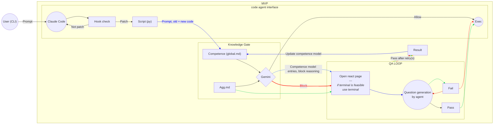

This project is building a mentor-gated coding workflow that sits between a user and one or more coding agents. The core idea is not to stop AI coding outright, but to intercept proposed code mutations at the moment they would be applied, then decide whether to let them through silently, require a quick review, ask a short understanding question, or redirect the user into a more guided implementation flow. The system is explicitly trying to balance three things at once: developer throughput, risk control, and actual learning/understanding rather than passive acceptance of AI-generated code. The intended MVP is lightweight and practical, not a full intelligent tutoring system.

Architecturally, the project treats every mutation attempt as a shared pipeline: edit interception → patch object creation → patch analysis → competence/memory retrieval → policy decision → intervention → outcome logging. The mentor service is designed as a modular, tool-centered layer with an adapter in front of the agent, a stateless decision engine, analyzers such as diff parsing and static checks, a rule-based policy engine, and storage consisting of an append-only event log, a lightweight user skill store, and a retrieval index. Unified diffs are the canonical interchange format, and the mentor stores past patch events, question outcomes, and final results so it can both audit behavior and improve decisions over time.

A key design principle is that the system should reason about mutations, not plans. Every agent-originated edit is normalized into a common PatchProposal object so the policy engine only consumes one shared representation regardless of which coding agent produced it. That proposal includes the diff, touched paths, raw tool input, provenance, and metadata. The decision space is roughly: allow, ask for confirmation, question_gate, guide, or deny. This makes the mentor portable across agent ecosystems and keeps host-specific adapters thin.

A major technical focus is where to intercept edits reliably. For Claude Code, the cleanest chokepoint is PreToolUse on Edit|Write, where the hook can allow, deny, ask, or rewrite tool input before the write occurs. For OpenCode, the likely interception points are a plugin hook such as tool.execute.before, the permissions layer around edit/write/patch tools, or the server boundary. More generally, the project identifies interception layers across CLI, IDE, and editor environments: tool boundaries, WorkspaceEdit/LSP apply boundaries, and isolated worktree/PR flows. File watchers are considered too late for true prevention; they are better for audit and rollback than for gating.

The policy itself is competence-aware and risk-aware. Low-risk, familiar, well-supported patches can be auto-accepted. Moderate-risk or conceptually novel patches should trigger a short mechanism question. High-risk, broad, or weakly supported patches should trigger guided implementation instead of direct application. Risk signals include sensitive file paths, dependency/config changes, diff size, security relevance, churn, and static analysis findings. Competence is intentionally simple in the MVP: track what concepts the user has recently explained or applied successfully, whether similar accepted patches later regressed, and whether the user can answer short mechanism questions. Retrieval uses past patches, prior explanations, and repository context, starting with lexical/AST-aware search and later embeddings or graph-enhanced repo retrieval.

Pedagogically, the project favors minimal, high-leverage interventions: one or two short questions, scaffolded walkthroughs, faded examples, or TODO-skeleton guidance rather than long quizzes. The goal is productive struggle with low interruption cost. Evaluation is dual-purpose: does the mentor reduce adoption of plausible-but-wrong patches, and does it improve delayed understanding and transfer instead of merely slowing the user down.

If you want, I can also turn this into a tighter 200-word “system prompt style” version for other LLMs.

